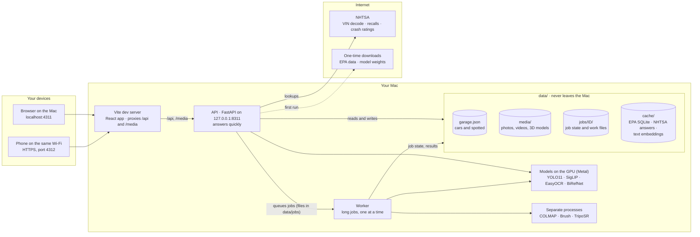
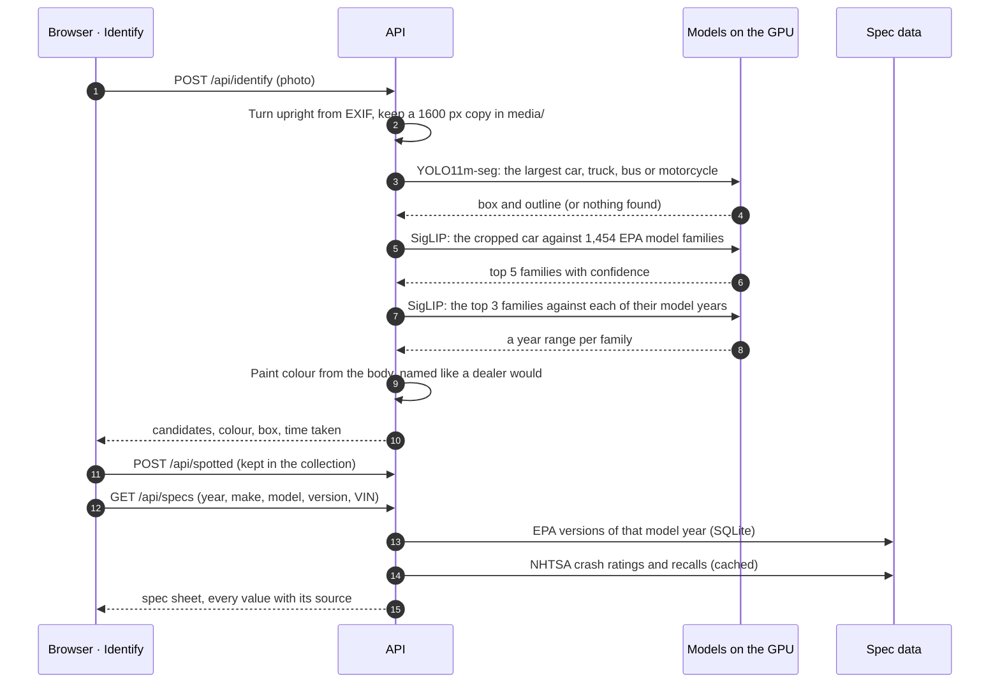
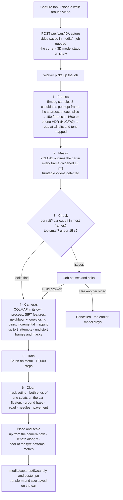
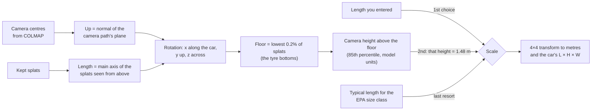
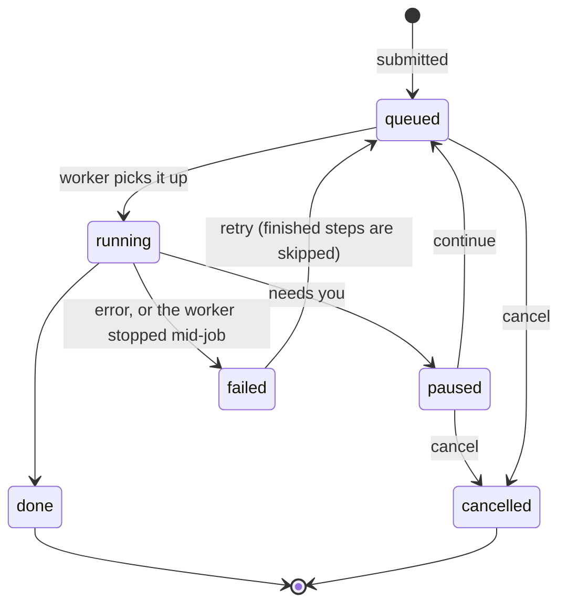
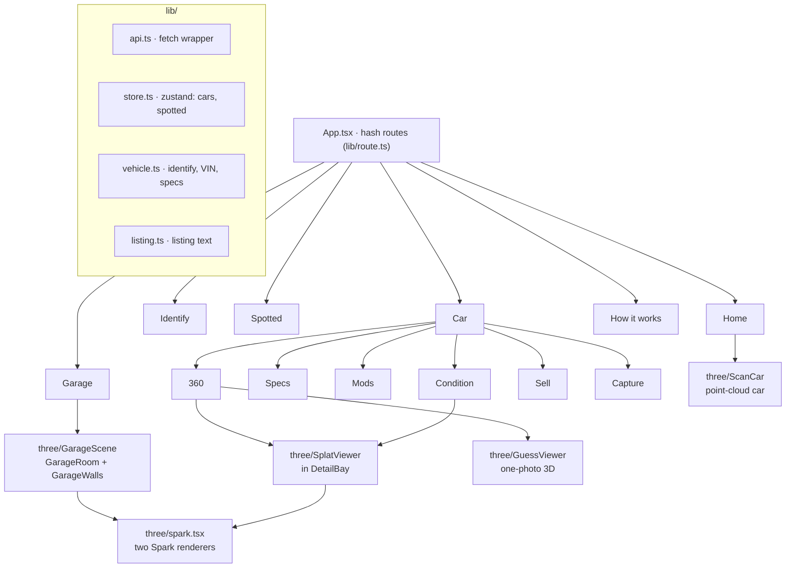
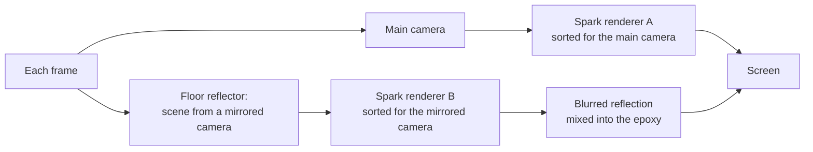

# Chassis

Chassis runs on your Mac and does two things:

- **Identification with calibrated confidence.** One photo gives the make, model and likely model years, matched against every model in the EPA’s U.S. records since 1984. The match percentage means what it says: on 600 held-out photos, matches shown at 95% or more were right 98% of the time, and those at 50–80% about 75%. A VIN makes it exact.
- **Metric-accurate 3D from a phone video.** A 30–60 second walk-around becomes a photoreal Gaussian-splat model at true size, scaled from the height the phone was held at (or exactly, from a length you enter). A Lexus UX filmed on an iPhone measured 4.49 × 1.84 × 1.49 m (length × width × height); the real car is 4.50 × 1.84 × 1.54 m.

Around those two: a check for a car you're thinking of buying (the VIN against the ad, the history report, the mileage and a fair price), the EPA and NHTSA spec sheet with owner complaints, a collection of every car you've spotted, a one-photo 3D sketch when there's no video, paint and wheel previews, a condition record, a sell kit with a Kelley Blue Book link, and a garage that parks your cars side by side at real size.

Everything runs locally. Photos, videos and 3D models stay in `data/` on your Mac; the only network traffic is NHTSA lookups and the one-time downloads of public data and model weights.

## Contents

- [Features in detail](#features-in-detail)
- [Set up and run](#set-up-and-run)
- [Architecture](#architecture)
  - [High-level](#high-level)
  - [Processes](#processes)
  - [Identifying a car](#identifying-a-car)
  - [Spec sheet](#spec-sheet)
  - [The 3D capture pipeline](#the-3d-capture-pipeline)
  - [Placement and true scale](#placement-and-true-scale)
  - [Jobs](#jobs)
  - [The website](#the-website)
  - [Rendering in the browser](#rendering-in-the-browser)
  - [The buying check](#the-buying-check)
  - [Mods, condition and selling](#mods-condition-and-selling)
- [Data model](#data-model)
- [API reference](#api-reference)
- [Repository layout](#repository-layout)
- [How well it works](#how-well-it-works)
- [Development](#development)
- [Troubleshooting](#troubleshooting)
- [Limitations](#limitations)
- [Data and models](#data-and-models)

## Features in detail

| Page | Route | What it does |
|---|---|---|
| **Home** | `#/` | The two leads, your garage at a glance, how it works. |
| **Identify** | `#/identify` | A photo, one camera shot, or **quick spotting** (`#/identify/quick`), where the camera stays open and every car is logged. The result shows the make, model, year range, paint colour, how sure it is and the other likely matches, then the full spec sheet. Correct it with another match, the model year, the VIN (typed or photographed) or a manual pick, then add it to your garage, or choose **Thinking of buying it?** to check it over. |
| **Spotted** | `#/spotted` | Every car identified from a photo, kept automatically: photo, name, headline figures, tallies (count, makes, most seen), sorted by newest or by make. Open one for the full sheet or add it to the garage. |
| **My garage** | `#/garage` | Your cars parked at real size in a 3D garage (hex lighting, reflective epoxy floor, detailed walls), or as a list. **Compare two cars**: sizes as bars, then their spec sheets row by row. |
| **Car** | `#/car/<id>/<tab>` | One car, in tabs: |
| ↳ 360 | `#/car/<id>` | The 3D model in a detail bay with spec hotspots, turning on its own until you grab it. Enter the exact length, flip front and back, film again or rebuild from the same video. Without a video: the one-photo 3D sketch. |
| ↳ Specs | `…/specs` | The spec sheet for the chosen engine, transmission and drive: powertrain, economy, running cost, size class, crash ratings and recalls. Every value is labelled with its source. |
| ↳ Mods | `…/mods` | Repaint the car in one of its photos (gloss, satin or matte), change the wheel finish (black, gunmetal, bronze, silver, white, gold) and tint the windows. Save looks. |
| ↳ Condition | `…/condition` | Pin scratches and dents on the 3D model or a photo, compare a before and an after photo of the same view (what changed is outlined), and print a dated record. |
| ↳ Buying | `…/buying` | For a car you're thinking of buying (it replaces Sell; **I bought it** switches back). A summary of what checks out, what to look into and the questions to ask the seller, then six steps: the VIN and what it says the car was built as; the pasted ad checked claim by claim against the VIN; the NICB theft and total-loss check and NHTSA's open-recall check (you run them and note the answer); the Carfax or AutoCheck report read from its PDF or text, or entered by hand; the mileage, typed or read from an odometer photo, against the average and the last reported reading; and a fair price from the KBB value you look up, less what the history shows, set against the asking price. |
| ↳ Sell | `…/sell` | Studio photos (the car cut out onto a studio, graphite or white backdrop), a listing written from the spec data and what you enter, a Kelley Blue Book link for pricing, and a downloadable kit: a small static website with the photos, listing, specs and the 3D model. |
| ↳ Capture | `…/capture` | Upload a walk-around and watch it build step by step: a shooting guide, a check of the video's shape and length before uploading, and a pause to ask if the video looks likely to fail. |
| **How it works** | `#/about` | Each stage explained, accuracy figures, which models are installed, the one-time car-parts model setup, and licences. |

Old links (`#/snap`, `#/spotter`) still land on Identify.

## Set up and run

Needs an Apple Silicon Mac (M1 or later, 16 GB memory), Node 18+, and an arm64 Python 3.10 with ffmpeg. [Miniforge](https://github.com/conda-forge/miniforge) is the easiest way to get the Python:

```sh
~/miniforge3/bin/conda install -y python=3.10 ffmpeg
bash scripts/setup.sh        # Python and web packages, Brush, TripoSR; safe to run again
npm run dev                  # http://localhost:4311
```

`scripts/setup.sh` creates `server/.venv`, installs `server/requirements.txt` and the npm packages, downloads the Brush splat trainer into `tools/` (checksum-verified), and clones TripoSR into `tools/TripoSR`. Set `PYTHON=/path/to/python3.10` to use a different interpreter.

The first time each feature runs it downloads what it needs: EPA data (2 MB), YOLO11 (45 MB), SigLIP (3.3 GB), EasyOCR (95 MB), BiRefNet (170 MB) and TripoSR (1.6 GB), about 5.3 GB in all. The car-parts model for wheel and tint previews is trained once on this Mac from the **How it works** page (about two hours on an M1 Pro, in the background).

**On your phone:** `npm run phone` serves the site over HTTPS on your Wi-Fi at `https://<this-mac>:4312`. Phones only allow the camera on secure pages; accept the certificate warning once (it's this Mac's own). Quick spotting is at `https://<this-mac>:4312/#/identify/quick`.

Use a Python from miniforge or python.org, not Homebrew under Rosetta: Intel builds of PyTorch can't use the Mac's GPU.

## Architecture

### High-level



The browser only ever talks to the Vite server, which serves the React app and forwards `/api` and `/media` to the Python API. The API handles everything that takes a second or two (identifying a photo, building a spec sheet, rendering a mod preview) on a thread, so it keeps answering in the meantime. Anything slow (a 3D capture, a one-photo 3D guess, training the car-parts model) becomes a job on disk, run by a separate worker process.

### Processes

| Process | Started by | What it is |
|---|---|---|
| API | `npm run api` | `uvicorn garage.app:app` on 127.0.0.1:8311, reloading when `server/garage` changes. Interactive docs at `/api/docs`. |
| Worker | `npm run worker` | `python -m garage.worker`: checks `data/jobs/` every second and runs queued jobs one at a time. It isn't reloaded: restart it after changing job code. |
| Web | `npm run web` | Vite on localhost:4311 (or 0.0.0.0:4312 over HTTPS with `npm run phone`). |
| SfM | the worker | `python -m garage.capture.sfm`: pycolmap in its own process, because pycolmap and PyTorch each ship an OpenMP runtime and can't share one. |
| Brush | the worker | The splat trainer, a native binary in `tools/`, run inside a pseudo-terminal so its progress bar can be read. |
| TripoSR | the worker | `python -m garage.guess3d`: its own process, so the 1.6 GB model leaves memory when it's done. |

`npm run dev` (`scripts/dev.mjs`) starts the API, worker and web server together; Control-C stops all three.

### Identifying a car



- **Finding the car** (`vision/detect.py`): YOLO11m segmentation keeps the largest vehicle and its outline. The crop is its box plus a margin, squared up so the classifier sees the whole car.
- **Naming it** (`vision/identify.py`): SigLIP So400m (384 px) embeds the crop, and each EPA model family as text ("a photo of a Honda Civic.", two phrasings averaged). A softmax over the 1,454 families gives the confidence. The family text embeddings are computed once and cached in `data/cache/families-*.pt`. The softmax temperature was checked against held-out photos and is calibrated as it stands (see [How well it works](#how-well-it-works)).
- **Model years**: for the top three families, every model year gets its own text ("a photo of a 2017 Honda Civic."). The range grows outward from the most likely year until it holds 90% of the year probability or reaches five years.
- **Paint colour** (`vision/color.py`): the body between the roofline and the sills is clustered in Lab space. Clusters of one hue count together, and coloured paint wins over grey reflections when enough of the body is coloured. The result is named from a list of dealer paint names ("Pearl white", "Red-orange").
- **VIN** (`vision/vin.py`): EasyOCR reads the windscreen plate, door sticker or registration. North American VINs carry a check digit (position 9), so the real VIN can be told apart from misreads, and look-alikes (S/5, B/8, Z/2, G/6, D/0) are swapped until the check digit agrees. NHTSA's decoder confirms it, and the decode is mapped onto an EPA family.
- **Spotted**: every car the Identify page finds is posted to `/api/spotted`. Corrections (another match, the year, the VIN, the engine version) update that entry, and its headline figures (engine and economy, or range for an EV) are filled in once the spec sheet loads.

### Spec sheet

`specs/sheet.py` builds the sheet for one model year:

- **EPA** (`specs/epa.py`): `vehicles.csv` from fueleconomy.gov, downloaded once and loaded into `data/cache/epa.sqlite`. Each row is one version of a model (engine × transmission × drive); `baseModel` groups the versions into the families a photo is matched against. From it: engine, fuel, transmission, drive, electric motor, city/highway/combined economy, EV range, annual fuel cost (at 15,000 miles), CO₂ and size class.
- **NHTSA** (`specs/nhtsa.py`): vPIC VIN decoding (adding horsepower, body, doors, trim and where it was built), recalls, owner complaints and NCAP 5-star ratings (overall, frontal, side, rollover). No key needed. Answers are cached in `data/cache/web.sqlite` (VIN decodes permanently, recalls and complaints for a week), so pages load instantly the second time and work offline.
- **Complaints**: NHTSA files them under its own model names ("UX 200", "UX 250H" for the EPA's "UX"), so each EPA family is matched to NHTSA's names for that year, leaving out names that belong to a more specific EPA family ("Prius c" isn't counted as the Prius). The sheet shows the count, the parts most complained about, how many involved a crash, fire or injury, and the latest in the owners' words.
- **Version matching**: with a VIN, the EPA version closest to what NHTSA decoded (displacement, drive, cylinders) is chosen; otherwise you pick it.
- Every value carries its source: "EPA", "NHTSA VIN decode" or "NHTSA 5-star ratings".

### The 3D capture pipeline



1. **Frames** (`capture/frames.py`): ffmpeg extracts three candidates for every frame to be kept, and the sharpest of each slice (by variance of the Laplacian) is kept: 150 frames at 1600 px on the long side. iPhones film HDR (HLG, or PQ) by default, which comes out flat and grey if read naively, so those frames are re-read as 16-bit RGB and converted properly: the HLG curve undone with the 1.2 system gamma at 1,000 nits (or the PQ curve), 203-nit reference white mapped to SDR white, BT.2020 to BT.709 primaries, and a soft roll-off above 0.8.
2. **Masks** (`capture/masks.py`): YOLO11 outlines the car in every frame, widened by 15 px so tyres and mirrors aren't clipped. If the background barely moves while the car does, it's a turntable video.
3. **Check** (`capture/check.py`): before the long part, the framing is measured. If the video is portrait, the car runs off the sides of more than 75% of frames, fills more than 65% of the picture, takes up less than 6% of it, is found in under 60% of frames, or the video is under 15 seconds, the job pauses with the reasons in plain words. **Build anyway** resumes it; **Use another video** cancels it and the earlier model stays. The thresholds come from real captures.
4. **Cameras** (`capture/sfm.py`): COLMAP structure-from-motion through pycolmap. SIFT (6,000 features per frame); each frame is matched with its next ten, and every fifth frame with every other fifth (so the end of the loop finds the start); then incremental mapping. Up to three attempts (with or without masks, one lens or one per frame) until 60% of frames are placed; under 40% fails with advice. The result is undistorted to pinhole cameras, and the masks with it.
5. **Train** (`capture/train.py`): [Brush](https://github.com/ArthurBrussee/brush) trains the Gaussian splat on the GPU for 12,000 steps at up to 1280 px.
6. **Clean** (`capture/clean.py`): every splat's centre is projected into 30 frames; it stays if it lands on the car (outline pulled in by 10 px) in at least 60% of the frames that see it. Long splats must keep both ends on the car. Then only the largest connected blob is kept (floaters go), and what's left of the ground goes: haze below the car, flat splats at floor level, low splats outside the car's outline seen from above, pale splats at pavement height, and needle-like streaks.
7. **Place and scale**: see below. The splat file itself is only filtered, never moved; the viewer applies one 4×4 transform, so view-dependent colour stays correct.

Retries skip finished steps, since each step's output stays in `data/jobs/<id>/`. Filming a car again keeps its current model on show until the new one is built, and brings it back with a note if the new video fails (`capture/record.py`). **Rebuild from the same video** reruns everything on the stored video; `server/tools/reclean.py CAR_ID` reruns only the clean-up and scaling, in seconds.

### Placement and true scale



COLMAP's reconstruction has no units. But the camera path was walked around the car with the phone at about chest height, and once the floor is known, the cameras' height above it is a measurement in model units. Setting that height to 1.48 m gives the scale. The 85th percentile is used, so a lower second loop doesn't pull it down. A result outside 2.8–7.5 m is rejected as implausible, and the EPA size class's typical length is used instead. A length you enter always wins.

### Jobs



A job is a folder, `data/jobs/<id>/`, holding `state.json` and its work files (frames, masks, the COLMAP dataset, Brush output, logs). The API only writes state files; the worker (`garage/worker.py`) runs the oldest queued job. State is written to a temp file and swapped in, so a crash never leaves half a file. When the worker starts, any job it was running is marked failed ("The app was closed while this was running"), and retrying picks up from the last finished step. Each kind of job has a runner and a failure hook in `jobs.RUNNERS`: `capture`, `guess` (one-photo 3D) and `parts` (car-parts model training). The website polls `/api/jobs/<id>` every two seconds.

### The website



- React 18 and TypeScript, built with Vite. State is a small zustand store (`lib/store.ts`) holding the cars and the Spotted list, loaded from the API at start.
- Hash routes (`#/car/<id>/specs`), so back and forward, refreshing and sharing all work with no server-side router. Pages with Gaussian splats load the 3D code only when opened.
- The listing text (`lib/listing.ts`) is written by plain rules from the spec sheet and what you enter, not by a language model, so every claim comes from the data or from you.
- Design: Archivo (condensed) for headings, Inter for text, JetBrains Mono for figures, and one orange (`#ff6a1f`) as the signal colour.

### Rendering in the browser

- **Splats**: [Spark](https://sparkjs.dev) draws Gaussian splats inside the ordinary three.js scene (React Three Fiber). Each car is a `SplatMesh` placed by its capture's transform.
- **Rooms**: the garage (`GarageRoom`, `GarageWalls`) and the single-car detail bay (`DetailBay`) are built from geometry and canvas-drawn textures, with no image files: a hexagon LED grid, a glossy epoxy floor, walnut slat walls, cabinets, a backlit sign, wheels, a charger and frosted doors. Area lights sit under the hex grids, with warm point lights along the walls.
- **Floor reflections**: drei's `MeshReflectorMaterial` draws the scene again from a mirrored camera, blurs it and mixes it into the floor. Spark sorts splats back to front for the camera that draws them, so one shared order would show each car's far side through its near side in one of the two views. There are therefore two Spark renderers, each shown only to its own camera:



- **Cameras**: the garage view stands at eye level, far enough back to see the whole row, and can't turn past the walls or rise through the ceiling. The detail bay orbits the car and keeps the camera under the ceiling by limiting how far it can look down the further out it goes. On tall, narrow screens (phones), the garage stands closer and the detail bay widens its lens, so the cars don't shrink to specks.

### The buying check

- **The ad** (`web/src/lib/adcheck.ts`): plain rules read the year, make, model, engine (litres, cylinders), drive, transmission, hybrid or electric, turbo, mileage and price from pasted listing text, and each claim is set against the VIN's decode. A field the maker doesn't encode in the VIN is shown as "the VIN doesn't say", never as a match or a mismatch; a CVT counts as an automatic.
- **NICB and open recalls**: neither has a public API (NHTSA's recall-by-VIN service needs a key and its site blocks automated browsers), so the page copies the VIN, links to each, and records what you saw.
- **History report** (`server/garage/history.py`): pypdf extracts the PDF's text, and rules written against real Carfax reports (several layouts) and AutoCheck reports read accidents and their dates and severity, structural damage, airbags, insurance total loss, title brands, owners, service records and the last reported mileage. Anything the report doesn't state stays unknown. The PDF is kept in `data/media`.
- **Odometer photo** (`vision/odometer.py`): EasyOCR reads every number on the cluster; whole numbers of four to six digits near "ODO", "mi" or "km" rank first, trip meters (one decimal), clocks and temperatures are skipped, and you tap the right one.
- **Fair price** (`web/src/lib/buying.ts`): KBB values assume a clean history, so the KBB value you enter is reduced by the worst finding: 20–40% for a branded title or insurance total loss (KBB's rule of thumb), 10–25% for a reported accident (Carfax), 5–10% if it was minor, 20–30% if structural, airbag or severe. An odometer reading below one already reported blocks the estimate entirely.
- **No paint-mismatch check**: comparing paint colour panel by panel from photos was tried and dropped. On real photos, reflections move a single panel's colour by 13–16 ΔE, while a repainted panel differs by 2–5, so it would flag every car. When a report shows damage, the page suggests a paint thickness gauge instead.

### Mods, condition and selling

- **Mods** (`vision/mods.py`): inside the car's outline, each pixel is weighted by how close it is to the car's own paint, so glass, trim, tyres and chrome keep their look. It's then moved to the new colour in Lab space, keeping its brightness relative to the paint, so reflections and shading stay put. Satin and matte soften the highlights. Wheels and windows come from the car-parts model (YOLO11s-seg fine-tuned on Ultralytics' car-parts dataset by the one-time `parts` job): rims are fitted inside each wheel, and side windows are found inside the doors. Previews are cached per photo and settings.
- **Condition** (`vision/compare.py`): the after photo is lined up on the before photo (ORB features and a homography, then dense optical flow for the last few pixels), the lighting is evened out, and the two are compared by their edges rather than raw colour: a scratch adds edges, while a passing cloud mostly changes brightness. An edge only counts as new if the other photo has none within 7 px, and strips where the flow jumps (depth edges) are left out. Regions that changed more than the rest of the car are outlined.
- **Studio photos** (`vision/cutout.py`, `vision/studio.py`): BiRefNet lite cuts the car out (falling back to YOLO's outline, feathered, if it can't load). Only pieces lying mostly inside the car's box are kept, so people and other cars stay out. The car is placed on a backdrop with a contact shadow from its lowest band and a soft one under the body. Cut-outs and finished photos are cached separately, so switching backdrops is instant.
- **Listing kit** (`sell.py`): a zip of a static site: `index.html` with the photos, listing and spec sheet and, when there's a capture, the 3D model in a small viewer with three.js and Spark copied in, so it works offline. It needs a static host, because browsers won't load modules from `file://`; `README.txt` in the kit says how.
- **One photo → 3D** (`guess3d.py`): BiRefNet cuts the car out and centres it on grey at 512 px, then TripoSR guesses a mesh with vertex colours (marching cubes at 256³). It can't see the far side of the car, so the result is always labelled a guess. TripoSR imports two packages Chassis doesn't need; `garage/shims` stands in for them.

## Data model

`data/garage.json` holds two lists; the files it points to (`/media/...`) are in `data/media/`. A car (the Lexus from the examples above, trimmed):

```jsonc
{
  "cars": [
    {
      "id": "14f2ec9f70",
      "createdAt": 1791303516.298,
      "nickname": null,
      "identity": {
        "make": "Lexus", "model": "UX",
        "yearFrom": 2019, "yearTo": 2023, // the likely range from the photo…
        "year": 2019,                     // …and the year chosen
        "source": "photo",                // photo | vin | manual
        "confidence": 0.9724,             // photo matches only
        "variant": 41089,                 // the EPA version chosen for the spec sheet
        "alternatives": [{ "make": "Lexus", "model": "TX", "yearFrom": 2024, "yearTo": 2026, "confidence": 0.0162 }]
      },
      "color": { "name": "Red-orange", "hex": "#b95a4b" },
      "photo": "/media/….jpg",
      "photos": ["/media/….jpg"],
      "specs": { /* the spec sheet as last shown */ },
      "capture": {
        "status": "done",                 // queued | running | paused | done | failed
        "job": "c94e0c6609",
        "video": "/media/69f85c0c40.mov",
        "splat": "/media/captures/c94e0c6609/car.ply",
        "poster": "/media/captures/c94e0c6609/poster.jpg",
        "transform": [ /* 16 numbers, row-major: splat → metres, y up, length along x */ ],
        "size": [4.486, 1.491, 1.837],    // length, height, width (m)
        "length": 4.486,
        "lengthSource": "camera",         // you | camera | size class
        "front": -1,                      // flipped: the model faced backwards along x
        "stats": { "frames": 150, "placed": 150, "splats": 146620, "turntable": false, "minutes": 26.1 }
      },
      "previousCapture": null,            // the earlier model, on show while a new one builds
      "guess": null,                      // one-photo 3D: { status, job, model: "/media/….glb" }
      "looks": [],                        // saved mods
      "condition": { "pins": [], "comparisons": [] },
      "sell": { "style": "detailed", "backdrop": "studio", "listing": "For sale: my red-orange 2019 Lexus UX. …" },
      "status": "own",                    // own (or unset) | considering: a car you're thinking of buying
      "buying": null                      // for a considering car: { vin, photoGuess, ad, history, mileage, asking, kbb, nicb, openRecalls }
    }
  ],
  "spotted": [
    {
      "id": "c125190690", "createdAt": 1791316667.273, "photo": "/media/6a61d280e4.jpg",
      "identity": { "make": "Toyota", "model": "RAV4", "yearFrom": 2015, "yearTo": 2018, "year": 2016, "source": "photo", "confidence": 0.8136 },
      "color": { "name": "Red", "hex": "#ec3534" },
      "headline": [
        { "label": "Engine", "value": "2.5 L 4-cyl", "source": "EPA" },
        { "label": "Combined", "value": "25 mpg", "source": "EPA" }
      ]
    }
  ]
}
```

A job's `data/jobs/<id>/state.json`, mid-build:

```jsonc
{
  "id": "c94e0c6609", "kind": "capture", "status": "running",
  "carId": "14f2ec9f70", "video": "/media/69f85c0c40.mov",
  "createdAt": 1791316093.69, "startedAt": 1791316093.95, "error": null,
  "step": "train",
  "steps": [
    { "key": "frames",  "label": "Picking the sharpest frames", "status": "done", "progress": 1.0, "seconds": 30.4, "detail": "150 frames" },
    { "key": "masks",   "label": "Outlining the car in every frame", "status": "done", "progress": 1.0, "seconds": 19.4, "detail": "Car in 135 of 150 frames" },
    { "key": "check",   "label": "Checking the video will make a good 3D model", "status": "done", "progress": 1.0, "seconds": 0.5, "detail": "Looks good" },
    { "key": "cameras", "label": "Working out where the camera was", "status": "done", "progress": 1.0, "seconds": 159.4, "detail": "150 of 150 frames placed" },
    { "key": "train",   "label": "Building the 3D model", "status": "running", "progress": 0.42 },
    { "key": "clean",   "label": "Cutting the car out and standing it upright", "status": "waiting", "progress": 0.0 }
  ],
  "issues": null,      // set while paused: the reasons, in plain words
  "confirmed": false   // true once you chose "Build anyway"
}
```

## API reference

Served at `http://127.0.0.1:8311`, and at `/api` through the web server. Interactive docs are at `/api/docs`.

| Method | Path | What it does |
|---|---|---|
| GET | `/api/health` | Python version, GPU backend (`mps` or `cpu`), and the Mac's Wi-Fi address. |
| POST | `/api/identify` | Photo → the car's box and outline share, the top 5 families with confidence and years, and the paint colour. |
| POST | `/api/vin/read` | Photo of a VIN → the VIN, checked and decoded. |
| GET | `/api/vin/{vin}` | Decode a typed VIN: check digit, make, model, year, trim and the matching EPA family. |
| GET | `/api/specs` | `year`, `make`, `model`, optional `variant` and `vin` → the spec sheet. |
| GET | `/api/complaints` | `year`, `make`, `model` → owner complaints to NHTSA: count, parts, crashes, fires, injuries, the latest few. |
| POST | `/api/history/read` | A Carfax or AutoCheck report (PDF, or `text`) → the facts in it; the PDF is kept. |
| POST | `/api/odometer/read` | Photo of the instrument cluster → the numbers on it, likely odometer first. |
| GET | `/api/catalog/makes`, `/api/catalog/models`, `/api/catalog/years` | The EPA catalogue, for picking a car by hand. |
| GET | `/api/stats` | How many vehicles and families the EPA data holds. |
| GET, POST, PATCH, DELETE | `/api/cars[/{id}]`, `/api/spotted[/{id}]` | The garage and the Spotted collection. PATCH merges fields; DELETE also removes the files only that record used (and a car's finished 3D builds). |
| POST | `/api/media` | Store a file (e.g. another photo of a car). |
| POST | `/api/cars/{id}/capture` | Upload a walk-around video and queue a capture job. |
| POST | `/api/cars/{id}/capture/rebuild` | Rebuild from the video already on file. |
| POST | `/api/cars/{id}/guess` | Queue a one-photo 3D guess from a photo. |
| POST | `/api/cars/{id}/mods` | `{photo, paint, finish, wheel, tint}` → a preview image. |
| POST | `/api/cars/{id}/condition/compare` | A before and an after photo → the aligned pair and outlined changes. |
| POST | `/api/cars/{id}/studio` | `{photo, backdrop}` → a studio photo. |
| GET | `/api/cars/{id}/kit` | The listing kit as a zip. |
| GET | `/api/garage/scene` | Every car with its real size (measured, entered or typical), colour and 3D model. |
| GET | `/api/jobs/{id}` | A job's state. |
| POST | `/api/jobs/{id}/retry`, `/continue`, `/cancel` | Retry a failed job, build anyway, or stop a paused or waiting one. |
| GET, POST | `/api/setup`, `/api/setup/parts` | Which optional models are installed; start training the car-parts model. |

## Repository layout

```text
garage-360/
├── scripts/
│   ├── dev.mjs                 starts the API, worker and web server together
│   └── setup.sh                one-time setup: venv, packages, Brush, TripoSR
├── server/
│   ├── requirements.txt
│   ├── garage/
│   │   ├── app.py              the API (FastAPI)
│   │   ├── worker.py           runs queued jobs
│   │   ├── jobs.py             job state on disk: submit, pause, resume, cancel, retry, recover
│   │   ├── store.py            data/garage.json and data/media
│   │   ├── paths.py            data/, media/, cache/, tools/
│   │   ├── capture/            the 3D pipeline: frames, masks, check, sfm, train, clean, record, pipeline
│   │   ├── vision/             models, detect, identify, color, vin, odometer, mods, compare, cutout, studio
│   │   ├── specs/              epa, nhtsa, sheet, cache
│   │   ├── guess3d.py          one photo → 3D (TripoSR)
│   │   ├── partsmodel.py       trains the car-parts model (a one-time job)
│   │   ├── sell.py             studio photos and the listing kit
│   │   ├── history.py          reads Carfax and AutoCheck reports
│   │   ├── dimensions.py       typical sizes by EPA size class
│   │   └── shims/              stand-ins for two packages TripoSR imports
│   ├── tests/                  server tests (python server/tests/run.py)
│   └── tools/
│       ├── eval_identify.py    measures identification on Stanford Cars
│       └── reclean.py          reruns a capture's clean-up and scaling
├── web/
│   ├── index.html
│   └── src/
│       ├── App.tsx, main.tsx
│       ├── pages/              Home, Identify, Spotted, Garage, Car, About, car/{Car360,Capture,Mods,Condition,Sell}
│       ├── three/              GarageScene, GarageRoom, GarageWalls, DetailBay, SplatViewer, spark, ScanCar, GuessViewer
│       ├── ui/                 Header, Footer, Camera, PhotoDrop, SpecSheetView, VinEntry, JobProgress, Spotted, …
│       ├── lib/                api, store, route, types, vehicle, listing, kbb, adcheck, buying (with tests)
│       └── styles/global.css
├── vite.config.ts              dev server, /api and /media proxy, HTTPS for phones
├── tools/                      (not in git) Brush, TripoSR, model weights
└── data/                       (not in git) your garage, media, jobs and caches
```

## How well it works

Identification, measured with `server/tools/eval_identify.py --skip 600` on 600 photos from the Stanford Cars test set (177 models sold in the U.S.) that weren't used for tuning:

| | |
|---|---|
| Exact make and model | 81% |
| In the top five | 97% |
| Right make | 96% |
| True year inside the range shown | 86% (ranges average 4.6 years) |
| Time per photo, M1 Pro | 0.8 s |

Calibration on the same photos, meaning how often the top match was right at each confidence shown:

| Confidence shown | Photos | Right |
|---|---|---|
| 95% or more | 159 | 98% |
| 80–95% | 166 | 89% |
| 50–80% | 189 | 75% |
| Under 50% | 86 | 48% |

The most common mistakes are near-twins: a Ferrari 458 Italia taken for the Spider, a Jaguar XK for the XKR, an Acura TL for the TSX.

3D capture:

- A Lexus UX walk-around filmed on an iPhone, scaled from the camera height alone, measures 4.49 × 1.84 × 1.49 m (length × width × height) against the real car's 4.50 × 1.84 × 1.54 m. An earlier build of the same video, before the clean-up rules were tightened, measured 4.46 × 1.85 × 1.49 m. Both builds are within 4 cm on length; the height comes out about 5 cm low.
- The Tanks and Temples "Truck" scene: 150 of 150 frames placed, about 16 minutes of training on an M1 Pro. A full capture takes 15–30 minutes.

The car-parts model (YOLO11s-seg fine-tuned on the Ultralytics car-parts dataset, 23 parts) reaches 0.70 mask mAP50 on its validation photos. The before/after comparison finds a drawn-on scratch on a re-shot photo and flags nothing on an unchanged one; photos taken from noticeably different spots get small false outlines near edges, glass and wheels, and the page says so.

## Development

```sh
npm test            # web tests (vitest) and server tests
npm run typecheck   # TypeScript
npm run build       # typecheck, then a production build into dist/
```

- **Server tests** (`server/tests/`): the job lifecycle (fail and retry, pause then continue or stop, recovery after a restart), capture records and retakes, placement and scaling, HDR conversion, the pre-build video check, the clean-up rules (road, needles, pavement), VIN check digits and reading, studio compositing, depth edges in before/after comparison, the listing page, media paths, files freed when a record is removed, typical sizes by class, reading history reports, ranking odometer numbers and NHTSA model names.
- **Web tests** (`web/src/lib/*.test.ts`): routes (including the old Snap and Spotter links), listing text, Kelley Blue Book links, the VIN helper, reading and checking ads, mileage, fair price and the buying summary.
- **Measuring identification**: `server/.venv/bin/python server/tools/eval_identify.py --n 600 --skip 600` writes a summary with accuracy, calibration bins and the most common mistakes to `data/eval/`. Set `GARAGE_SIGLIP=model,pretrained` to try another SigLIP or CLIP model.
- **Re-cleaning a capture** after changing `capture/clean.py`: `server/.venv/bin/python server/tools/reclean.py CAR_ID` (keeps the previous model as `car.before.ply`).
- **Logs**: a job's folder holds `sfm.log`, `brush.log` and, if it failed, `error.log` with the full trace.
- The worker isn't reloaded automatically: restart `npm run dev`, or just the worker, after changing job code.

## Troubleshooting

| Symptom | Likely cause |
|---|---|
| A banner says the local engine isn't running | The API isn't up. Start everything with `npm run dev` in this folder. |
| A 3D build stays on "Waiting to start" | The worker isn't running. `npm run dev` starts it; `npm run worker` starts it on its own. |
| Identification or training is very slow | PyTorch is an Intel build running under Rosetta and can't use the GPU. `/api/health` should say `"gpu": "mps"`; reinstall with an arm64 Python. |
| "ffmpeg isn't installed" | `conda install ffmpeg` into the same miniforge Python. |
| The capture paused | The video looks likely to come out smeared (portrait, too close, too short). Film again, or choose Build anyway. |
| "Only N of M frames could be placed" | Walk more slowly, in softer light, keeping the whole car in the frame; a second loop helps. |
| The 3D model is the wrong size | The phone was held well above or below chest height. Enter the exact length on the 360 tab. |
| The phone shows a certificate warning | Expected, once: it's this Mac's own certificate, and the camera needs HTTPS. |
| Wheel and tint previews are missing | The car-parts model isn't trained yet. Start it from How it works. |

## Limitations

- **U.S. models from 1984 on**, as listed in the EPA's fuel economy records. Heavy trucks, big vans and cars never sold in the U.S. aren't included.
- **Calibration was measured on Stanford Cars photos**, which are mostly clean shots. Street photos from a phone may be calibrated less well.
- **The camera-height scale assumes chest height** (1.48 m). Every 10 cm above or below shifts the size by about 7%; entering the length removes the guess.
- **Gaussian splats bake in the light** they were filmed in: reflections on the paint stay where they were, and shiny or black paint is harder to capture well.
- **One photo → 3D invents the far side** of the car, and is always labelled a guess.
- **Personal use only**, because Chassis uses Ultralytics YOLO11 (AGPL-3.0).

## Data and models

| | Used for | Licence |
|---|---|---|
| EPA fuel economy data | Model list, specs, economy, size class | Public domain |
| NHTSA vPIC, Recalls, NCAP | VIN decoding, recalls, crash ratings | Public domain |
| YOLO11 (Ultralytics) | Finding cars; car-parts model | AGPL-3.0 |
| Ultralytics car-parts dataset | Training the car-parts model | CC BY 4.0 |
| SigLIP So400m | Identifying the model | Apache 2.0 |
| EasyOCR | Reading VINs and odometers | Apache 2.0 |
| pypdf | Reading history report PDFs | BSD-3-Clause |
| COLMAP / pycolmap | Camera positions | BSD |
| Brush | Splat training | Apache 2.0 |
| BiRefNet | Cut-outs | MIT |
| TripoSR | One photo → 3D | MIT |
| three.js, React Three Fiber, drei, Spark | 3D in the browser | MIT |
| Stanford Cars | Measuring identification only | Research use |

Because it uses Ultralytics YOLO11 (AGPL-3.0), Chassis is for personal use on your own machine. Specs come from public U.S. government data; NHTSA is asked about VINs, recalls and ratings, and models are downloaded the first time they're needed. Your photos, videos and garage never leave your Mac. Not affiliated with any carmaker, the EPA, NHTSA or Kelley Blue Book.
