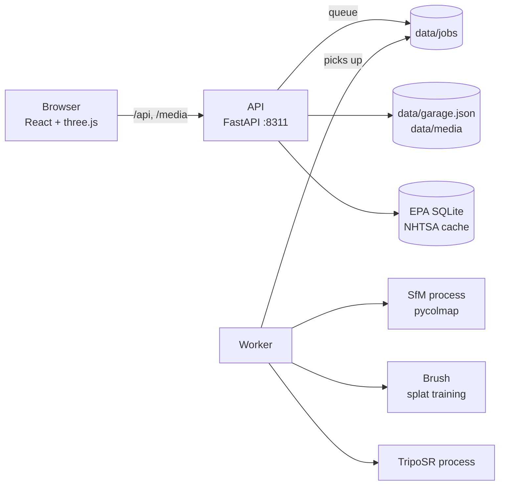

# Chassis

Take a photo of a car and get what it is and everything about it. Film a 30-second walk-around and it becomes a photoreal 3D model you can spin, restyle, inspect, sell and park in your own virtual garage. It all runs on your Mac.

- **Snap & Spec**: a photo becomes the make, model and likely years, with the spec sheet: engine, gearbox, fuel economy, running cost, crash ratings and recalls. Add the VIN (typed or photographed) to make it exact.
- **Spotter**: point your phone at cars on the street and build a collection of everything you've seen.
- **Walk-around 360**: a short video becomes a Gaussian-splat 3D model of the car, scaled to real size, with spec hotspots.
- **One photo → 3D**: no video? An AI sketch of the shape from a single photo, always labelled as a guess.
- **Mods**: try paint colours and finishes, wheel colours and window tint on a photo of your car.
- **Condition**: pin scratches and dents on the 3D model or a photo, compare before and after photos, print a report.
- **Sell kit**: studio photos with the background swapped, a listing written from the spec data, and a small website with the photos, specs and 3D model to host anywhere.
- **Virtual garage**: every car parked side by side at real size; compare any two.

## Set up

Needs an Apple Silicon Mac (M1 or later, 16 GB memory), Node 18+, and an arm64 Python 3.10 with ffmpeg. [Miniforge](https://github.com/conda-forge/miniforge) is the easiest way to get the Python:

```sh
~/miniforge3/bin/conda install -y python=3.10 ffmpeg
bash scripts/setup.sh        # Python and web packages, Brush, TripoSR; safe to run again
npm run dev                  # http://localhost:4311
```

The first time each feature runs it downloads what it needs: EPA data (2 MB), YOLO11 (45 MB), SigLIP (3.3 GB), EasyOCR (95 MB), BiRefNet (170 MB) and TripoSR (1.6 GB): about 5.3 GB in all, so leave room. The car-parts model for wheel and tint previews is trained once on this Mac, from the **How it works** page (about two hours on an M1 Pro, in the background).

**On your phone:** `npm run phone` serves the site on your Wi-Fi at `https://<this-mac>:4312` (accept the certificate warning once; it's this Mac's own). Spotter and the camera work from there.

Use a Python from miniforge or python.org, not Homebrew under Rosetta: Intel builds of PyTorch can't use the Mac's GPU.

## How it fits together



- **web/**: React 18, TypeScript and Vite. Three.js through React Three Fiber; [Spark](https://sparkjs.dev) draws the Gaussian splats. Hash routes (`#/car/<id>/specs`).
- **server/garage/**: the API (`app.py`) answers quickly; anything slow (3D capture, one-photo 3D, training the car-parts model) is a job in `data/jobs/<id>/state.json`, run by a separate worker (`worker.py`). Jobs survive restarts: a retry skips the steps already done.
- pycolmap and PyTorch each ship their own OpenMP, so structure-from-motion runs in its own process, as does TripoSR (so its 1.6 GB model leaves memory when it's done).
- **data/** (not in git) holds your garage, photos, videos and 3D models. Nothing else is stored anywhere.

### The 3D capture pipeline

1. **Frames**: ffmpeg pulls the sharpest frame from each slice of the video (150 frames, 1600 px).
2. **Masks**: YOLO11 outlines the car in every frame; turntable videos are detected (the background stands still while the car turns).
3. **Cameras**: COLMAP structure-from-motion places each frame (sequential plus loop-closing pairs), then undistorts frames and masks.
4. **Training**: Brush trains a Gaussian splat on the masked frames (12,000 steps).
5. **Clean-up**: splats not on the car in most views are dropped, then everything but the main body, then ground haze.
6. **Placement**: up is the normal of the camera path; length runs along the car's long axis; scale comes from the length you enter or the typical length for its EPA size class.

The test truck (Tanks and Temples "Truck"): 150 of 150 frames placed, 124,000 splats, about 16 minutes of training on an M1 Pro.

## How well it works

Identification, measured with `server/tools/eval_identify.py --skip 600` on 600 photos from the Stanford Cars test set (177 models sold in the U.S.) that were not used for tuning:

| | |
|---|---|
| Exact make and model | 81% |
| In the top five | 97% |
| Right make | 96% |
| True year inside the range shown | 86% (ranges average 4.6 years) |
| Time per photo, M1 Pro | 0.8 s |

The match percentage is calibrated: matches shown at 95% or more were right 98% of the time, those at 50–80% about 75%.

The car-parts model (YOLO11s-seg fine-tuned on the Ultralytics car-parts dataset, 23 parts) reaches 0.70 mask mAP50 on its validation photos. The before/after comparison finds a drawn-on scratch on a re-shot photo and flags nothing on an unchanged one; photos from noticeably different spots get small false outlines near edges, glass and wheels, and the page says so.

## Tests

```sh
npm test          # web (vitest) and server tests
npm run typecheck
```

## Data and models

| | Used for | Licence |
|---|---|---|
| EPA fuel economy data | Model list, specs, economy, size class | Public domain |
| NHTSA vPIC, Recalls, NCAP | VIN decoding, recalls, crash ratings | Public domain |
| YOLO11 (Ultralytics) | Finding cars; car-parts model | AGPL-3.0 |
| Ultralytics car-parts dataset | Training the car-parts model | CC BY 4.0 |
| SigLIP So400m | Identifying the model | Apache 2.0 |
| EasyOCR | Reading VINs | Apache 2.0 |
| COLMAP / pycolmap | Camera positions | BSD |
| Brush | Splat training | Apache 2.0 |
| BiRefNet | Cut-outs | MIT |
| TripoSR | One photo → 3D | MIT |
| three.js, Spark | 3D in the browser | MIT |
| Stanford Cars | Measuring identification only | Research use |

Because it uses Ultralytics YOLO11 (AGPL-3.0), Chassis is for personal use on your own machine. Specs come from public U.S. government data; NHTSA is asked about VINs, recalls and ratings, and models are downloaded the first time they're needed. Your photos, videos and garage never leave your Mac.
